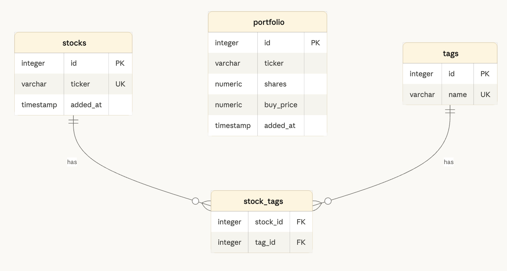

# Stock Tracker

A personal stock tracking web application built with Streamlit and PostgreSQL. Users can monitor a watchlist of stocks with live price data, organize stocks with custom tags, and track portfolio positions with real-time gain/loss calculations.

## Live App

[stock-tracker on Streamlit Community Cloud](https://dani3lkim-stock-tracker.streamlit.app)

## ERD



## Table Descriptions

### stocks
Stores tickers on the watchlist. Each ticker must be unique. `added_at` records when it was added.

| Column | Type | Description |
|---|---|---|
| id | SERIAL PK | Auto-incrementing identifier |
| ticker | VARCHAR(10) | Stock ticker symbol (e.g. AAPL) |
| added_at | TIMESTAMP | When the stock was added |

### portfolio
Stores individual buy positions. A user can hold multiple positions in the same ticker (e.g. bought at different times).

| Column | Type | Description |
|---|---|---|
| id | SERIAL PK | Auto-incrementing identifier |
| ticker | VARCHAR(10) | Stock ticker symbol |
| shares | NUMERIC | Number of shares purchased |
| buy_price | NUMERIC | Price per share at time of purchase |
| added_at | TIMESTAMP | When the position was logged |

### tags
Stores user-defined category labels (e.g. "Tech", "Dividend", "Speculative").

| Column | Type | Description |
|---|---|---|
| id | SERIAL PK | Auto-incrementing identifier |
| name | VARCHAR(50) | Unique tag name |

### stock_tags
Junction table implementing the many-to-many relationship between stocks and tags. A stock can have many tags; a tag can apply to many stocks.

| Column | Type | Description |
|---|---|---|
| stock_id | INTEGER FK | References stocks.id (CASCADE delete) |
| tag_id | INTEGER FK | References tags.id (CASCADE delete) |

## How to Run Locally

**1. Clone the repo**
```bash
git clone https://github.com/dani3lkim/stock-tracker.git
cd stock-tracker
```

**2. Install dependencies**
```bash
pip install -r requirements.txt
```

**3. Set up secrets**

Create a file at `.streamlit/secrets.toml` (this file is gitignored — never commit it):
```toml
DB_URL = "your_postgresql_connection_url_here"
```

**4. Run the app**
```bash
streamlit run app.py
```

## Pages

- **Dashboard** — live summary metrics and watchlist overview
- **Watchlist** — add/remove stocks, assign tags, view live prices and charts
- **Portfolio** — track buy positions, view current value and gain/loss, edit or delete positions
- **Tags** — create and manage tags used to categorize watchlist stocks
